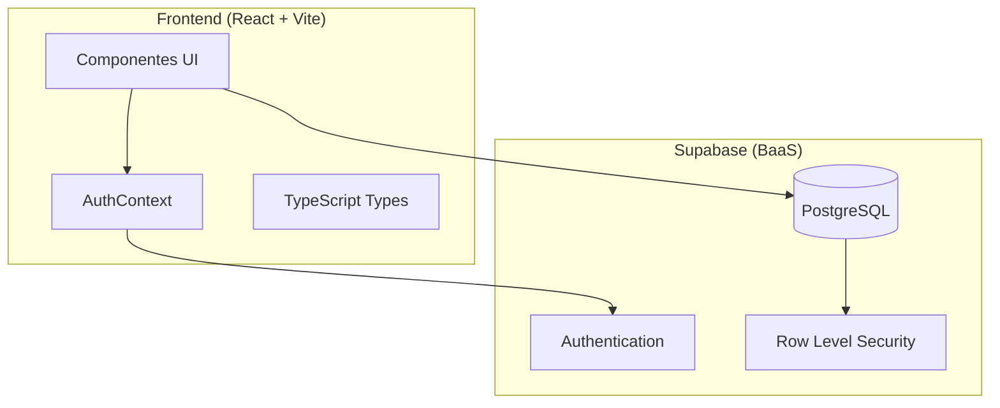
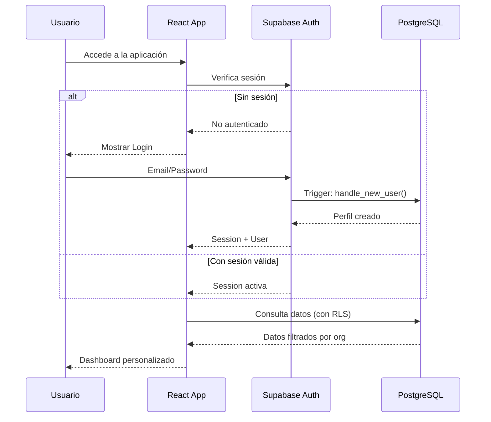

# 🏛️ Arquitectura del Sistema

## Visión General

Trantor Tracker SaaS es una aplicación **multi-tenant B2B** construida con una arquitectura moderna de frontend React + backend Supabase (PostgreSQL + Auth).



## Stack Tecnológico

### Frontend
| Tecnología | Versión | Propósito |
|------------|---------|-----------|
| React | 19.2.3 | Framework UI |
| Vite | 6.2.0 | Build tool y dev server |
| TypeScript | 5.8.2 | Tipado estático |
| Lucide React | 0.562.0 | Iconografía |
| Recharts | 3.6.0 | Gráficas y dashboards |

### Backend
| Tecnología | Propósito |
|------------|-----------|
| Supabase | BaaS (Backend as a Service) |
| PostgreSQL | Base de datos relacional |
| Row Level Security | Aislamiento de datos por tenant |

## Patrones de Arquitectura

### 1. Multi-tenancy
El sistema implementa **aislamiento a nivel de fila** donde cada registro de negocio está asociado a una `organization_id`. Las políticas RLS garantizan que un usuario solo pueda acceder a datos de su organización.

```sql
-- Ejemplo de política RLS
CREATE POLICY "Users view modules of their org"
ON public.tracker_modules FOR SELECT
USING ( organization_id = public.get_my_org_id() );
```

### 2. Component-Based Architecture
La UI está organizada en componentes especializados por vista/funcionalidad:

- **Views**: Componentes de página completa (`DashboardView`, `ModulesView`, etc.)
- **Shared**: Componentes reutilizables (`StatusBadge`, `Icons`)
- **Layout**: Navegación y estructura (dentro de `App.tsx`)

### 3. Context API para Estado Global
El estado de autenticación se maneja mediante React Context (`AuthContext`) que:
- Gestiona sesiones de Supabase Auth
- Provee información del usuario actual y su organización
- Determina permisos basados en rol

## Flujo de Autenticación



## Flujo de Datos por Rol

### SUPER_ADMIN (BackOffice)
1. Ve todas las organizaciones
2. Puede crear/editar módulos, timeline, usuarios
3. Gestiona invitaciones a nuevos usuarios

### CLIENT_USER (Portal)
1. Ve solo datos de su organización
2. Dashboard, Módulos, Timeline en modo lectura
3. Puede crear Tickets de soporte

## Consideraciones de Seguridad

### Zero Trust Database
Las políticas RLS se aplican **siempre**, incluso si el frontend es comprometido:

```sql
-- Funciones helper SECURITY DEFINER
CREATE FUNCTION public.get_my_role() RETURNS user_role
SECURITY DEFINER AS $$ ... $$;

CREATE FUNCTION public.get_my_org_id() RETURNS uuid
SECURITY DEFINER AS $$ ... $$;
```

### Principio de Mínimo Privilegio
- `CLIENT_USER`: Solo SELECT en la mayoría de tablas
- `ORG_ADMIN`: SELECT + UPDATE en su organización
- `SUPER_ADMIN`: Acceso total (ALL)
