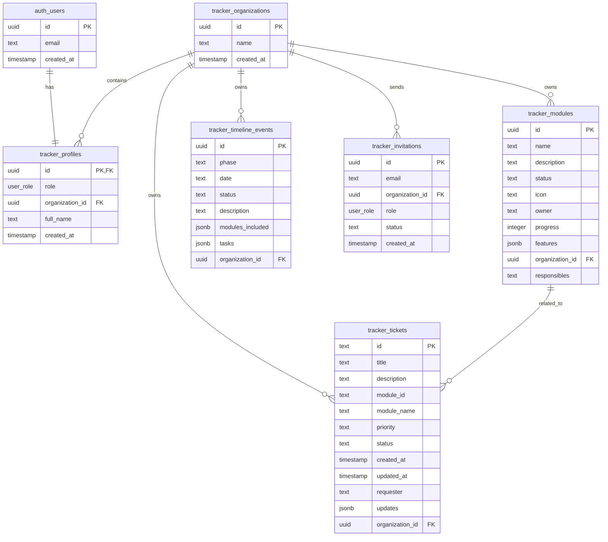

# 🗄️ Base de Datos

## Modelo de Datos

### Diagrama Entidad-Relación



## Tablas Principales

### `tracker_organizations`
Entidad raíz para multi-tenancy. Cada cliente es una organización.

| Columna | Tipo | Descripción |
|---------|------|-------------|
| `id` | UUID | Identificador único (PK) |
| `name` | TEXT | Nombre de la organización |
| `created_at` | TIMESTAMPTZ | Fecha de creación |

### `tracker_profiles`
Extensión del usuario autenticado con rol y organización.

| Columna | Tipo | Descripción |
|---------|------|-------------|
| `id` | UUID | FK a `auth.users` (PK) |
| `role` | `user_role` | SUPER_ADMIN, ORG_ADMIN, CLIENT_USER |
| `organization_id` | UUID | FK a `tracker_organizations` |
| `full_name` | TEXT | Nombre completo |
| `created_at` | TIMESTAMPTZ | Fecha de creación |

### `tracker_modules`
Módulos ERP asignados a cada organización.

| Columna | Tipo | Descripción |
|---------|------|-------------|
| `id` | UUID | Identificador único |
| `name` | TEXT | Nombre del módulo |
| `description` | TEXT | Descripción |
| `status` | TEXT | COMPLETED, IN_PROGRESS, PENDING, etc. |
| `icon` | TEXT | Nombre del icono (Lucide) |
| `owner` | TEXT | Responsable principal |
| `progress` | INTEGER | % de avance (0-100) |
| `features` | JSONB | Array de subfuncionalidades |
| `organization_id` | UUID | FK a organizaciones |
| `responsibles` | TEXT | Lista de responsables adicionales |

### `tracker_timeline_events`
Fases y sprints del proyecto.

| Columna | Tipo | Descripción |
|---------|------|-------------|
| `id` | UUID | Identificador único |
| `phase` | TEXT | Nombre de la fase/sprint |
| `date` | TEXT | Rango de fechas |
| `status` | TEXT | Estado actual |
| `description` | TEXT | Descripción |
| `modules_included` | JSONB | Módulos en esta fase |
| `tasks` | JSONB | Tareas del sprint |
| `organization_id` | UUID | FK a organizaciones |

### `tracker_tickets`
Sistema de soporte/incidencias.

| Columna | Tipo | Descripción |
|---------|------|-------------|
| `id` | TEXT | ID legible (T-XXXX) |
| `title` | TEXT | Título del ticket |
| `description` | TEXT | Descripción detallada |
| `module_id` | TEXT | Módulo relacionado |
| `priority` | TEXT | Baja, Media, Alta, Crítica |
| `status` | TEXT | Abierto, En Revisión, Resuelto, Cerrado |
| `requester` | TEXT | Quien solicitó |
| `updates` | JSONB | Historial de comentarios |
| `organization_id` | UUID | FK a organizaciones |

### `tracker_invitations`
Invitaciones pendientes para nuevos usuarios.

| Columna | Tipo | Descripción |
|---------|------|-------------|
| `id` | UUID | Identificador único |
| `email` | TEXT | Email del invitado |
| `organization_id` | UUID | Organización destino |
| `role` | `user_role` | Rol asignado |
| `status` | TEXT | PENDING, ACCEPTED |
| `created_at` | TIMESTAMPTZ | Fecha de invitación |

---

## Tipos Personalizados (ENUMs)

### `user_role`
```sql
CREATE TYPE public.user_role AS ENUM (
  'SUPER_ADMIN',
  'ORG_ADMIN', 
  'CLIENT_USER'
);
```

---

## Migraciones SQL

Las migraciones se encuentran en `/supabase/migrations/` y deben ejecutarse en orden:

### 1. `20260128_init_multitenancy.sql`
**Propósito**: Crear estructura base multi-tenant.

**Acciones**:
- Crea `tracker_organizations`
- Crea tipo `user_role`
- Crea `tracker_profiles`
- Agrega `organization_id` a tablas existentes
- Habilita RLS en todas las tablas
- Semilla organización "Admin System" si no existe

```sql
-- Crear tabla de organizaciones
CREATE TABLE IF NOT EXISTS public.tracker_organizations (
  id uuid DEFAULT gen_random_uuid() PRIMARY KEY,
  name text NOT NULL,
  created_at timestamp with time zone DEFAULT timezone('utc'::text, now()) NOT NULL
);

-- Crear tabla de perfiles
CREATE TABLE IF NOT EXISTS public.tracker_profiles (
  id uuid REFERENCES auth.users ON DELETE CASCADE PRIMARY KEY,
  role public.user_role NOT NULL DEFAULT 'CLIENT_USER',
  organization_id uuid REFERENCES public.tracker_organizations(id),
  full_name text,
  created_at timestamp with time zone DEFAULT timezone('utc'::text, now()) NOT NULL
);

-- Habilitar RLS
ALTER TABLE public.tracker_organizations ENABLE ROW LEVEL SECURITY;
ALTER TABLE public.tracker_profiles ENABLE ROW LEVEL SECURITY;
ALTER TABLE public.tracker_modules ENABLE ROW LEVEL SECURITY;
-- ... (demás tablas)
```

---

### 2. `20260128_rls_policies.sql`
**Propósito**: Definir políticas de Row Level Security.

**Funciones Helper**:
```sql
-- Obtener rol del usuario actual (evita recursión RLS)
CREATE OR REPLACE FUNCTION public.get_my_role()
RETURNS public.user_role
LANGUAGE sql SECURITY DEFINER STABLE
AS $$ SELECT role FROM public.tracker_profiles WHERE id = auth.uid(); $$;

-- Obtener organization_id del usuario actual
CREATE OR REPLACE FUNCTION public.get_my_org_id()
RETURNS uuid
LANGUAGE sql SECURITY DEFINER STABLE
AS $$ SELECT organization_id FROM public.tracker_profiles WHERE id = auth.uid(); $$;
```

**Políticas por Tabla**:

| Tabla | Política | Condición |
|-------|----------|-----------|
| `tracker_profiles` | View own profile | `auth.uid() = id` |
| `tracker_profiles` | Admins view all | `get_my_role() = 'SUPER_ADMIN'` |
| `tracker_organizations` | View own org | `id = get_my_org_id()` |
| `tracker_organizations` | Admins view all | `get_my_role() = 'SUPER_ADMIN'` |
| `tracker_modules` | View org modules | `organization_id = get_my_org_id()` |
| `tracker_modules` | Admins manage | `get_my_role() = 'SUPER_ADMIN'` |
| `tracker_tickets` | View org tickets | `organization_id = get_my_org_id()` |
| `tracker_tickets` | Create for org | `organization_id = get_my_org_id()` |
| ... | ... | ... |

---

### 3. `20260128_link_new_users.sql`
**Propósito**: Crear perfil automáticamente al registrar usuario.

```sql
CREATE OR REPLACE FUNCTION public.handle_new_user() 
RETURNS trigger AS $$
DECLARE
  invite_record record;
BEGIN
  -- Buscar invitación pendiente
  SELECT * INTO invite_record
  FROM public.tracker_invitations
  WHERE email = new.email AND status = 'PENDING'
  ORDER BY created_at DESC LIMIT 1;

  IF found THEN
    -- Crear perfil con org y rol de la invitación
    INSERT INTO public.tracker_profiles (id, full_name, role, organization_id)
    VALUES (
      new.id,
      split_part(new.email, '@', 1),
      invite_record.role::public.user_role,
      invite_record.organization_id
    );
    -- Marcar invitación como aceptada
    UPDATE public.tracker_invitations SET status = 'ACCEPTED'
    WHERE id = invite_record.id;
  ELSE
    -- Sin invitación: crear perfil básico
    INSERT INTO public.tracker_profiles (id, full_name, role)
    VALUES (new.id, split_part(new.email, '@', 1), 'CLIENT_USER');
  END IF;

  RETURN new;
END;
$$ LANGUAGE plpgsql SECURITY DEFINER;

-- Trigger
CREATE OR REPLACE TRIGGER on_auth_user_created
  AFTER INSERT ON auth.users
  FOR EACH ROW EXECUTE FUNCTION public.handle_new_user();
```

---

### 4. `20260128_fix_missing_profile.sql`
**Propósito**: Script de reparación para usuarios existentes sin perfil.

Útil para corregir usuarios que se registraron antes de implementar el trigger.

---

### 5. `20260128_add_module_responsibles.sql`
**Propósito**: Agregar campo para múltiples responsables.

```sql
ALTER TABLE public.tracker_modules
ADD COLUMN IF NOT EXISTS responsibles text;
```

---

## Ejecución de Migraciones

### En Supabase Dashboard
1. Ir a **SQL Editor**
2. Copiar contenido de cada migración
3. Ejecutar en orden numérico

### Con Supabase CLI
```bash
supabase db push
```

---

## Consultas Útiles

### Ver usuarios por organización
```sql
SELECT p.full_name, p.role, o.name as org_name
FROM tracker_profiles p
LEFT JOIN tracker_organizations o ON p.organization_id = o.id;
```

### Ver módulos con progreso bajo
```sql
SELECT name, progress, organization_id
FROM tracker_modules
WHERE progress < 50
ORDER BY progress ASC;
```

### Ver tickets abiertos por prioridad
```sql
SELECT priority, COUNT(*) 
FROM tracker_tickets 
WHERE status != 'Cerrado'
GROUP BY priority;
```
